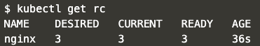

We have now had a chance to practice using our ingress controller to send our traffic to different pods based on our rules.

We will now look at how to use in-built load balancers to help spread the load across multiple replicas of a pod.

We can use kubernetes to automatically create a cloud network loadbalancer that provides an externally-accessible IP address. This then sends traffic to the correct port on your cluster nodes provided your cluster runs in a supported environment and is configured with the correct cloud load balancer provider package.

This will be issued via a Load Balancer such as ELB. This allows additional public IP addresses to be allocated to a Kubernetes cluster without interacting directly with the cloud provider.

>Note: As Katacoda is not a cloud provider additional setup is required (and has been done in our katacoda environment). If you want to test this locally on your own minikube version, you can run `minikube start --extra-config=apiserver.cloud-provider=aws --extra-config=controller-manager.cloud-provider=aws` to start the minikube service with all the neccessary settings.

## Task

We can create our service and expose it via a load balancer as usual either via kubectl or via a manifest.

### Kubectl

If we have an existing replication controller, we can then expose the rc using a loadbalancer.

To begin with, let's create a replication controller using our example `rc.yaml`{{open}} file that we have created for you by running `kubectl apply -f rc.yaml`{{execute}} so that we can have the resources available.

As we know that our docker image exposes port 80 internally, we can run `kubectl expose rc nginx --port=8765 --target-port=80 --name=http-service --type=LoadBalancer`{{execute}} to expose our service on port 8765 using a cloud provided loadbalancer.

In order to get access to the ip for our new load balancer we can run `export LoadBalancerIP=$(kubectl get services/http-service -o jsonpath='{.spec.clusterIP}')`{{execute}}.

Check all of our pods are running by running `kubectl get rc`{{execute}} and keep refreshing until 3 current pods are running. 

You should see a response similar to the one below.

To check the IP address we can run `echo LoadBalancerIP=$LoadBalancerIP`{{execute}} and can access the apps by running `curl $LoadBalancerIP:8765`{{execute}}.

We should see `<h1>This request was processed by host: nginx-4vfzj</h1>` (where the host is replaced by your pod names) returned. 

What we can see is that each time we `curl` the server we can see that it balances the load across the apps to distribute the workload.

### YAML Manifest

Alternatively we can set up our service file in a similar way to before, but with the addition the following line at the end of our service within the `spec` section.

<pre>  type: LoadBalancer</pre>

Let's begin by opening our `loadbalancer.yaml`{{open}} file.

<pre class="file"
data-filename="loadbalancer.yaml"
data-target="replace">
apiVersion: v1
kind: Service
metadata:
  name: yaml-service
spec:
  selector:
    app: nginx
  ports:
    - port: 8765
      targetPort: 80
  type: LoadBalancer</pre>
  
Then let's create our loadbalancer by running `kubectl apply -f loadbalancer.yaml`{{execute}}

We can then run similar commands to spread the workload. `export LoadBalancerYamlIP=$(kubectl get services/yaml-service -o jsonpath='{.spec.clusterIP}')`{{execute}}

We can verify the IP by running `echo LoadBalancerYamlIP=$LoadBalancerYamlIP`{{execute}}`

And test we can see a response similarly as well
`curl $LoadBalancerYamlIP:8765`{{execute}}