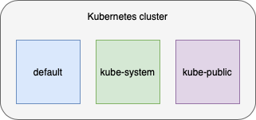

**Namespaces** isolate pods to separate workloads from each other and to give you the capability of setting up resource constrainsts. You can map namespaces to the different application environments you might consider.

## Discover Kubernetes namespaces

By default, Kubernetes comes with a few predefined namespaces. We can see them here

The most important default namespaces can be seen here.

### kube-system
This namespace has objects created by Kubernetes system:

`kubectl get pods -n kube-system`{{execute}}
This namespaces includes some of the pods needed to make kubernetes work. This includes controllers and add-ons integrated with Kubernetes (to be covered later).

>**Note**: Different cloud providers can also have their own kubernetes implementations here so this space may differ between providers.

### kube-public
This namespace has a `ConfigMap` containing the bootstrapping and certificate configuration for the Kubernetes cluster:

`kubectl get pods -n kube-public`{{execute}}

You won't see anything running in this namespace by default, but we can see a cluster-info `ConfigMap` (which we will cover later on):

`kubectl get configmap -n kube-public cluster-info -o yaml`{{execute}}

In addition, this namespace might be treated as a location used to run an object which should be visible and readable throughout the whole cluster.

### default
All objects created without specifying a namespace will automatically be created in the **default** namespace.

This namespace is initially empty and doesn't contain any objects:

`kubectl get pods -n default`{{execute}}

One thing to note about the default namespace is that it can't be deleted, unlike other namespaces within the Kubernetes cluster.
